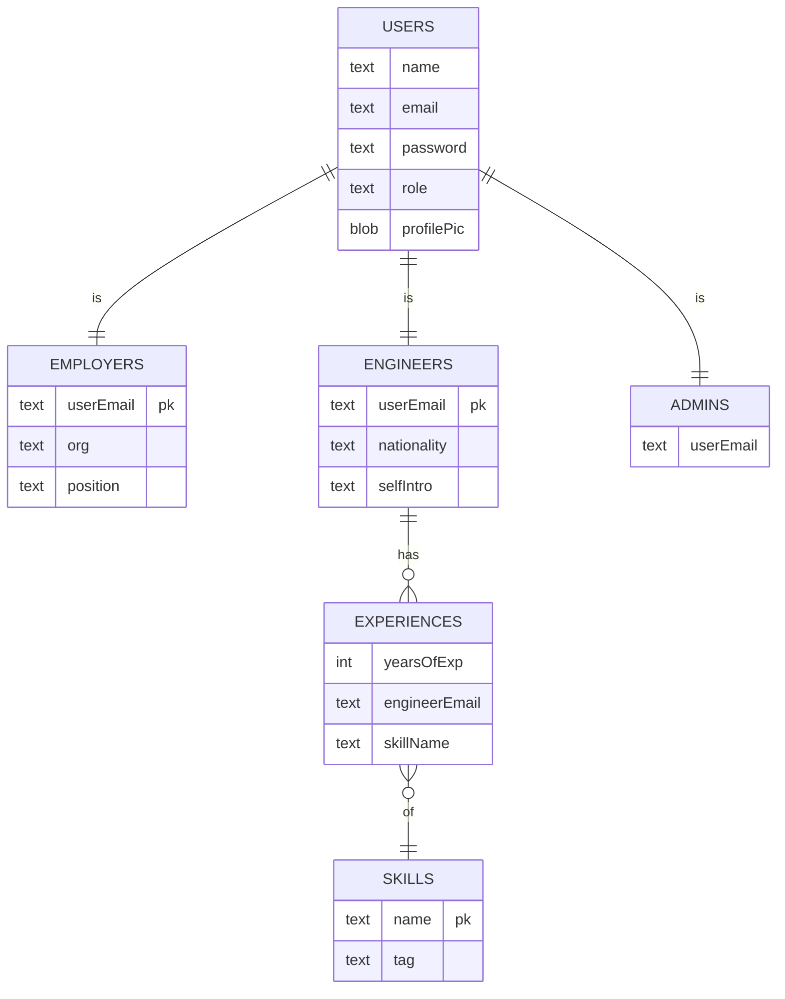

```mermaid
erDiagram

USERS       || -- ||    EMPLOYERS : is
USERS       || -- ||    ENGINEERS : is
USERS       || -- ||    ADMINS : is
ENGINEERS   || -- o{    EXPERIENCES : has
EXPERIENCES }o -- || SKILLS     : of


USERS {
    text        name
    text        email
    text        password
    text        role
    blob        profilePic
}

EMPLOYERS {
    text    userEmail   pk
    text    org
    text    position
}

ENGINEERS {
    text    userEmail   pk
    text    nationality
    text    selfIntro
}

ADMINS {
    text userEmail
}

SKILLS {
    text    name    pk
    text    tag     
}

EXPERIENCES {
    int     yearsOfExp
    text    engineerEmail
    text    skillName
}
```
