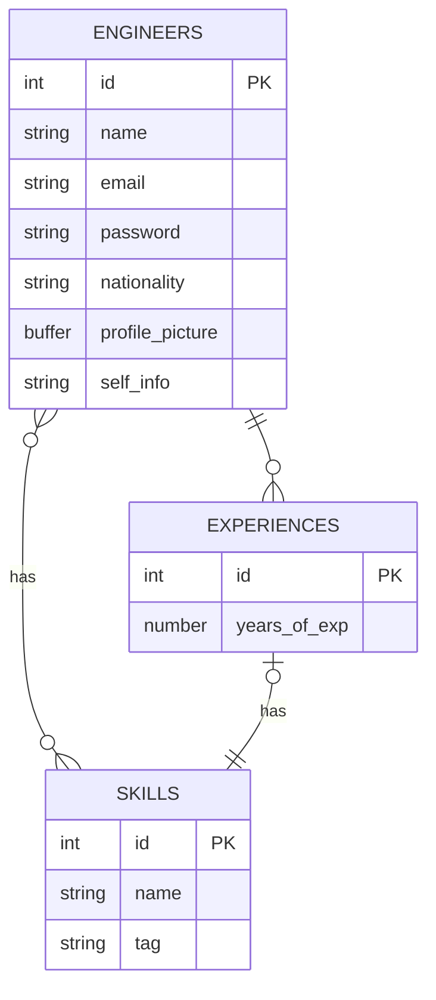

```mermaid
erDiagram

    ENGINEERS }o--o{ SKILLS : "has"
    ENGINEERS || -- o{ EXPERIENCES : ""
    EXPERIENCES |o -- || SKILLS : "has"


    ENGINEERS {
        int     id              PK
        string  name
        string  email
        string  password
        string  nationality
        buffer  profile_picture
        string  self_info
    }

    SKILLS {
        int     id              PK
        string  name
        string  tag
    }

    EXPERIENCES {
        int     id              PK
        number  years_of_exp

    }

```
